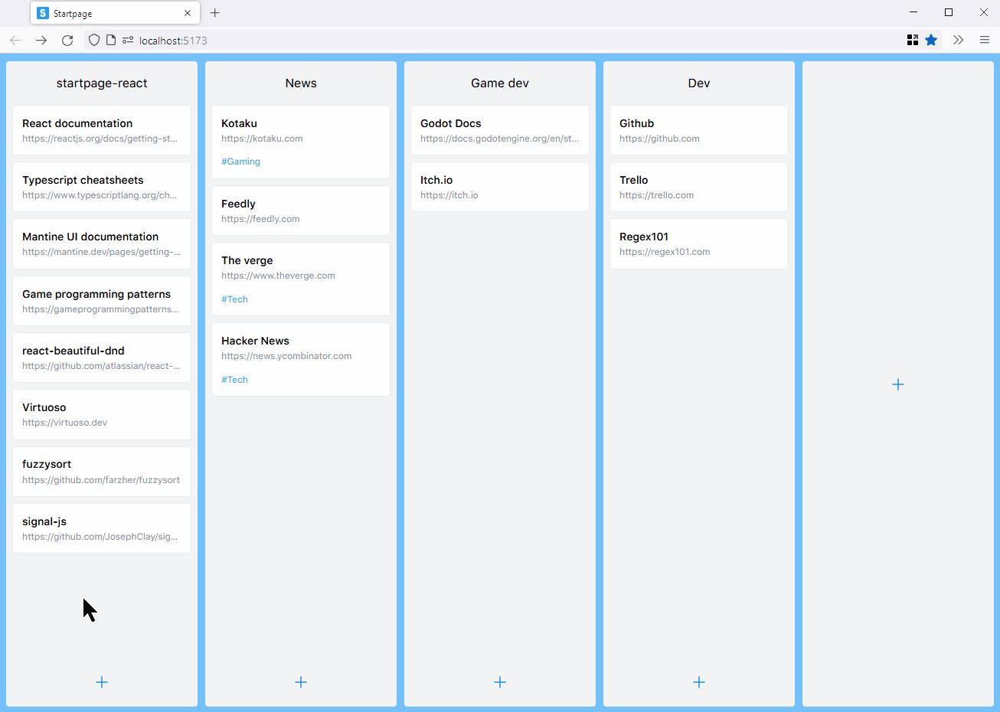

# startpage-react

## Description

Startpage is a **Kanban-like bookmark manager** where you can:

- Organize your bookmarks with drag and drop
- Open them by clicking on it or by searching for it in the Command Bar using a keyboard shortcut.

The user data is stored in the browser local storage, and it can be exported/imported in JSON format.

This is the new and improved version of [vanilla js Startpage](https://github.com/serogbp/Startpage).

Developed using:

- [React](https://reactjs.org/) + [Typescript](https://www.typescriptlang.org/) + [Vite](https://vitejs.dev/)
- [Mantine UI](https://mantine.dev/)
- [react-beautiful-dnd](https://github.com/atlassian/react-beautiful-dnd)
- [Virtuoso](https://virtuoso.dev/)
- [fuzzysort](https://github.com/farzher/fuzzysort/)
- [signal-js](https://github.com/JosephClay/signal-js)

## Features

- Command bar: filter bookmarks by name and url using fuzzy search
- Rearrange bookmarks and categories with drag and drop
- Customizable appearance:
  - Light and dark theme
  - Custom background and accent colors
- Import and export bookmarks and settings in JSON format
